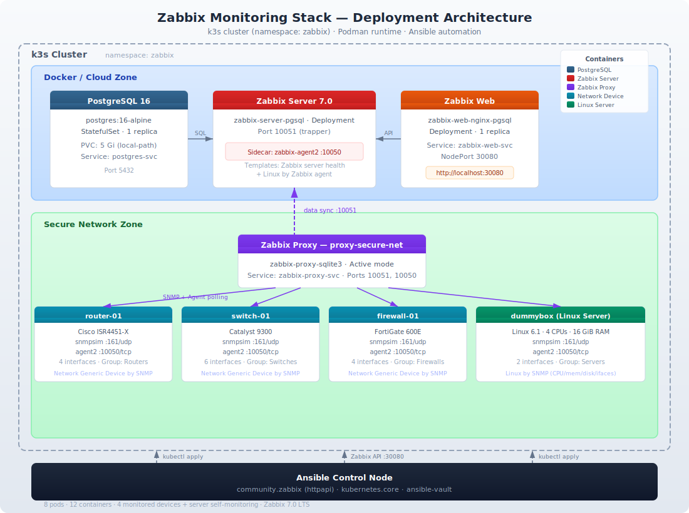

## Zabbix Monitoring 
### Automated deployment demo using ansible, k3s, podman
---

## Architecture



<details>
<summary>Text diagram (click to expand)</summary>

```
┌────────────────────────── k3s Cluster (namespace: zabbix) ──────────────────────────┐
│                                                                                     │
│   "Docker/Cloud" zone                                                               │
│   ┌─────────────────────────────────────────────────────────────────┐               │
│   │  PostgreSQL          Zabbix Server          Zabbix Web          │               │
│   │  StatefulSet·PVC5Gi  Deployment·10051       NodePort 30080      │               │
│   │                      + agent2 sidecar                           │               │
│   └───────────────────────────┬─────────────────────────────────────┘               │
│                               │                                                     │
│   "Secure Network" zone       │ data sync                                           │
│   ┌───────────────────────────▼─────────────────────────────────────┐               │
│   │                    Zabbix Proxy                                 │               │
│   │               (sqlite3 · active mode)                           │               │
│   │          polls SNMP :161/udp + Agent :10050/tcp                 │               │
│   │                                                                 │               │
│   │   ┌─────────────┐  ┌─────────────┐  ┌──────────────────┐        │               │
│   │   │  router-01  │  │  switch-01  │  │  firewall-01     │        │               │
│   │   │  snmpsim    │  │  snmpsim    │  │  snmpsim         │        │               │
│   │   │  agent2     │  │  agent2     │  │  agent2          │        │               │
│   │   │  4 ifaces   │  │  6 ifaces   │  │  4 ifaces        │        │               │
│   │   └─────────────┘  └─────────────┘  └──────────────────┘        │               │
│   │                                                                 │               │
│   │   ┌──────────────────────────────┐                              │               │
│   │   │  dummybox (Linux server)     │                              │               │
│   │   │  snmpsim + agent2            │                              │               │
│   │   │  2 ifaces · 4 CPUs · 16 GiB  │                              │               │
│   │   └──────────────────────────────┘                              │               │
│   └─────────────────────────────────────────────────────────────────┘               │
│                                                                                     │
└─────────────────────────────────────────────────────────────────────────────────────┘
         ▲
    Ansible control node
    community.zabbix · kubernetes.core
```

</details>

---

## Component Stack

| Component | Image | Purpose |
|---|---|---|
| PostgreSQL | `postgres:16-alpine` | Zabbix backend database |
| Zabbix Server | `zabbix/zabbix-server-pgsql:7.0-ubuntu-latest` | Core monitoring engine |
| Zabbix Agent 2 (server sidecar) | `zabbix/zabbix-agent2:7.0-ubuntu-latest` | Server self-monitoring |
| Zabbix Web | `zabbix/zabbix-web-nginx-pgsql:7.0-ubuntu-latest` | Dashboard (NodePort 30080) |
| Zabbix Proxy | `zabbix/zabbix-proxy-sqlite3:7.0-ubuntu-latest` | Secure-network proxy (active mode) |
| SNMP Simulator | `tandrup/snmpsim:latest` | Per-device SNMP responder (x4) |
| Zabbix Agent 2 (device sidecar) | `zabbix/zabbix-agent2:7.0-ubuntu-latest` | Sidecar agent per device (x4) |

**Total: 8 pods, 12 containers**

---

## Simulated Devices

| Device | Identity | Group | Interfaces | SNMP Data |
|---|---|---|---|---|
| `router-01` | Cisco ISR4451-X | Routers | Gi0/0/0, Gi0/0/1, Gi0/0/2, Loopback0 | IF-MIB + HOST-RESOURCES-MIB (8 GiB, 2 CPUs) |
| `switch-01` | Catalyst 9300 | Switches | Gi1/0/1-4, Te1/1/1, Vlan1 | IF-MIB + HOST-RESOURCES-MIB (4 GiB, 1 CPU) |
| `firewall-01` | FortiGate 600E | Firewalls | wan1, wan2, lan, dmz | IF-MIB + HOST-RESOURCES-MIB (16 GiB, 4 CPUs) |
| `dummybox` | Linux 6.1 (Ubuntu) | Servers | eth0, lo | IF-MIB + HOST-RESOURCES-MIB + UCD-SNMP-MIB (16 GiB, 4 CPUs, load avg, disk) |

Each device pod runs **two containers** (sidecar pattern):
1. **snmpsim** — serves device-specific `.snmprec` walk data on UDP 161
2. **zabbix-agent2** — passive agent on TCP 10050, reporting to the proxy

**Templates applied:**
- Network devices (router, switch, firewall): `Network Generic Device by SNMP`
- Linux server (dummybox): `Linux by SNMP` (includes interface discovery + CPU/memory/disk)

---

## Monitoring & Alerts

### Zabbix Server Self-Monitoring

The Zabbix server pod includes a zabbix-agent2 sidecar. The built-in "Zabbix server" host is enabled with:
- `Zabbix server health` — internal queue, cache, process monitoring
- `Linux by Zabbix agent` — OS-level metrics (CPU, memory, disk)

### Alert Thresholds

Triggers are provided by the linked templates with threshold macros overridden at host level. Values are tuneable in `group_vars/all.yml`:

| Trigger | Macro | Default | Severity |
|---|---|---|---|
| Interface down | `{$IFCONTROL}` | `1` (all interfaces) | Average |
| High bandwidth | `{$IF.UTIL.MAX}` | `80` (%) | Warning |
| Interface errors | `{$IF.ERRORS.WARN}` | `10` | Warning |
| SNMP community | `{$SNMP_COMMUNITY}` | `public` | — |

Additional thresholds for `dummybox` (via `Linux by SNMP` template):
- CPU load, memory utilisation, swap usage, filesystem discovery

A notification action ("Proxy device alerts") sends messages to the Admin user for any trigger >= Warning severity.

---

## Project Structure

```
zabbix-ansible/
├── README.md
├── ansible.cfg
├── requirements.yml
├── inventory/hosts.yml
├── group_vars/
│   ├── all.yml                  # All variables + thresholds
│   └── vault.yml                # Secrets (encrypt with ansible-vault)
├── playbooks/
│   ├── site.yml                 # Master — runs phases 0-3
│   ├── 00_install_deps.yml      # Installs podman, k3s, kubectl, python, collections
│   ├── 01_deploy_stack.yml      # PostgreSQL + Server + Web + Proxy
│   ├── 02_deploy_devices.yml    # 4 simulated devices (snmpsim + agent2)
│   ├── 03_configure_zabbix.yml  # API: proxy, hosts, templates, alerts
│   └── teardown.yml             # Separate teardown (deletes namespace)
├── roles/
│   ├── deps/tasks/main.yml      # OS-aware installer (macOS + Linux)
│   ├── zabbix_stack/tasks/main.yml
│   ├── devices/
│   │   ├── tasks/main.yml
│   │   └── files/
│   │       ├── router.snmprec
│   │       ├── switch.snmprec
│   │       ├── firewall.snmprec
│   │       └── dummybox.snmprec
│   └── zabbix_config/tasks/main.yml
└── manifests/
    ├── namespace.yml
    ├── postgres.yml             # StatefulSet + Service
    ├── zabbix-server.yml        # Deployment + Service (+ agent2 sidecar)
    ├── zabbix-web.yml           # Deployment + Service (NodePort 30080)
    ├── zabbix-proxy.yml         # Deployment + Service
    └── devices/
        ├── router.yml           # Deployment + Service
        ├── switch.yml           # Deployment + Service
        ├── firewall.yml         # Deployment + Service
        └── dummybox.yml         # Deployment + Service
```

---

## Prerequisites

Only **Python 3.10+** and **Ansible 2.15+** are required on the control node. Phase 0 installs everything else automatically:

```bash
pip install ansible
```

Phase 0 (`00_install_deps.yml`) installs:
- **podman** — container runtime (rootful machine on macOS)
- **k3d** (macOS) or **k3s** (Linux) — k3s cluster
- **kubectl** — cluster CLI
- **Python packages** — `kubernetes`, `psycopg2-binary`, `zabbix-utils`
- **Ansible collections** — `community.zabbix`, `kubernetes.core`

---

## Quick Start

```bash
cd zabbix-ansible

# 1. Set your passwords in the vault file
#    Required variables:
#      vault_postgres_password: "<pg-password>"
#      vault_zabbix_password:  "<zabbix-admin-password>"
vi group_vars/vault.yml
ansible-vault encrypt group_vars/vault.yml

# 2. Run the full deployment (installs deps + deploys + configures)
ansible-playbook playbooks/site.yml --ask-vault-pass

# 3. Open Zabbix — http://localhost:30080
#    Login: Admin / <your vault_zabbix_password>
```

To skip dependency installation (if podman/k3s/kubectl are already set up):

```bash
ansible-playbook playbooks/site.yml --ask-vault-pass --skip-tags deps
```

To re-run only specific phases:

```bash
# Redeploy devices only
ansible-playbook playbooks/site.yml --ask-vault-pass --tags devices

# Reconfigure Zabbix API only
ansible-playbook playbooks/site.yml --ask-vault-pass --tags configure

# Redeploy devices and reconfigure
ansible-playbook playbooks/site.yml --ask-vault-pass --tags devices,configure
```

Using a vault password file instead of interactive prompt:

```bash
echo 'vault-password' > /tmp/.vp && chmod 600 /tmp/.vp
ansible-playbook playbooks/site.yml --vault-password-file=/tmp/.vp
rm -f /tmp/.vp
```

---

## Deployment Phases

| Phase | Playbook | Role | Tag | What it does |
|---|---|---|---|---|
| 0 | `00_install_deps.yml` | `deps` | `deps` | Installs podman, k3s/k3d, kubectl, Python pkgs, Ansible collections |
| 1 | `01_deploy_stack.yml` | `zabbix_stack` | `stack` | Namespace, Secret, PostgreSQL, Zabbix Server (+agent2), Web, Proxy — with rollout waits |
| 2 | `02_deploy_devices.yml` | `devices` | `devices` | 4 ConfigMaps + 4 device pods (snmpsim + agent2 sidecar) |
| 3 | `03_configure_zabbix.yml` | `zabbix_config` | `configure` | API: password setup, host groups, proxy, hosts, server self-monitoring, alert action |

---

## How It Works

**Phase 0** detects the OS:
- **macOS** — installs `podman`, `k3d`, `kubectl` via Homebrew; starts a rootful podman machine; creates a k3s cluster inside podman containers via k3d
- **Linux** — installs `podman` via system package manager; installs k3s natively; copies kubeconfig

**Phase 1** deploys the core Zabbix stack to the `zabbix` namespace in dependency order: PostgreSQL (StatefulSet with 5 Gi PVC) → Zabbix Server with agent2 sidecar (connects to `postgres-svc`) → Zabbix Web (NodePort 30080) → Zabbix Proxy (active mode, SQLite3, connects to `zabbix-server-svc:10051`). Each component waits for readiness before the next starts.

**Phase 2** creates per-device ConfigMaps from `.snmprec` files and deploys four pods — each containing an SNMP simulator sidecar and a Zabbix Agent 2 sidecar. Each device gets its own ClusterIP Service exposing SNMP (UDP 161) and Agent (TCP 10050).

**Phase 3** waits for the Zabbix API, changes the default Admin password if still set to "zabbix", then via `community.zabbix` httpapi connection: creates host groups (Routers, Switches, Firewalls, Servers) → registers the active proxy → registers each device with dual interfaces (SNMP + Agent) and per-device templates → enables Zabbix server self-monitoring → creates an alert notification action.

---

## Accessing the Stack

| What | How |
|---|---|
| Zabbix Web | `http://localhost:30080` |
| Login | `Admin` / vault password |
| All pods | `kubectl get pods -n zabbix` |
| Pod logs | `kubectl logs -n zabbix deploy/zabbix-server -c zabbix-server` |
| PostgreSQL shell | `kubectl exec -n zabbix -it postgres-0 -- psql -U zabbix` |
| Test SNMP walk | `kubectl exec -n zabbix deploy/device-router-01 -c snmpsim -- ls /usr/local/share/snmpsim/data/` |

After login, navigate to **Monitoring > Hosts** to see all four devices and the Zabbix server reporting via `proxy-secure-net`.

---

## Teardown

Teardown is a separate playbook to prevent accidental execution:

```bash
# Remove all Zabbix resources (deletes the namespace and all k8s objects)
ansible-playbook playbooks/teardown.yml --ask-vault-pass

# Or manually
kubectl delete namespace zabbix

# Destroy the k3s cluster entirely (macOS)
k3d cluster delete zabbix

# Destroy the k3s cluster entirely (Linux)
/usr/local/bin/k3s-uninstall.sh
```

---

## Data Storage

| Data | Location | Persistence |
|---|---|---|
| Zabbix DB (PostgreSQL) | PVC `postgres-data` (5 Gi) in k3s local-path provisioner | Survives pod restarts; lost on namespace/cluster delete |
| Zabbix Proxy cache | SQLite3 inside proxy container (ephemeral) | Rebuilt automatically from server |
| SNMP simulation data | ConfigMaps from `.snmprec` files | Recreated on each deployment |

On macOS with k3d + podman, the PVC backing storage lives inside the k3d container's filesystem at `/var/lib/rancher/k3s/storage/`.

---

## Design Decisions

**Podman over Docker** — Podman is daemonless and rootless-capable, aligning with security best practices. On macOS, `podman machine` provides the Linux VM; k3d uses the podman socket to create a real k3s cluster inside podman containers.

**k3s over full Kubernetes** — k3s is a CNCF-certified lightweight distribution that starts in seconds with a single binary. Paired with k3d, it runs inside podman containers — no hypervisor or system-level install required on macOS.

**PostgreSQL storage** — All Zabbix data (configuration, history, trends) is stored in a PostgreSQL 16 StatefulSet with a 5 Gi PersistentVolumeClaim, ensuring data survives pod restarts.

**Zabbix Proxy (active, SQLite3)** — The proxy uses an embedded SQLite database (no second PostgreSQL needed) and active mode (initiates connection to the server), keeping the deployment simple while demonstrating the distributed monitoring pattern from the assessment architecture.

**Sidecar agent per device** — Each device pod bundles snmpsim + zabbix-agent2. The proxy polls both the SNMP interface (network metrics) and the Agent interface (host metrics) for each device, matching the assessment requirement for monitoring "network interfaces or resources (CPU/RAM/Storage)".

**community.zabbix 4.x httpapi model** — The `community.zabbix` collection v4+ uses Ansible's httpapi connection plugin for authentication instead of per-module `server_url`/`login_user`/`login_password` parameters. All API tasks run inside a block with httpapi connection variables.

**Separate teardown playbook** — Teardown is isolated in `playbooks/teardown.yml` rather than tagged inside the deploy playbook. This prevents accidental execution due to Ansible's `import_playbook` tag inheritance behaviour.

**Idempotent everything** — All Ansible tasks use `state: present`. Re-running `site.yml` after a partial failure resumes cleanly without creating duplicates.
